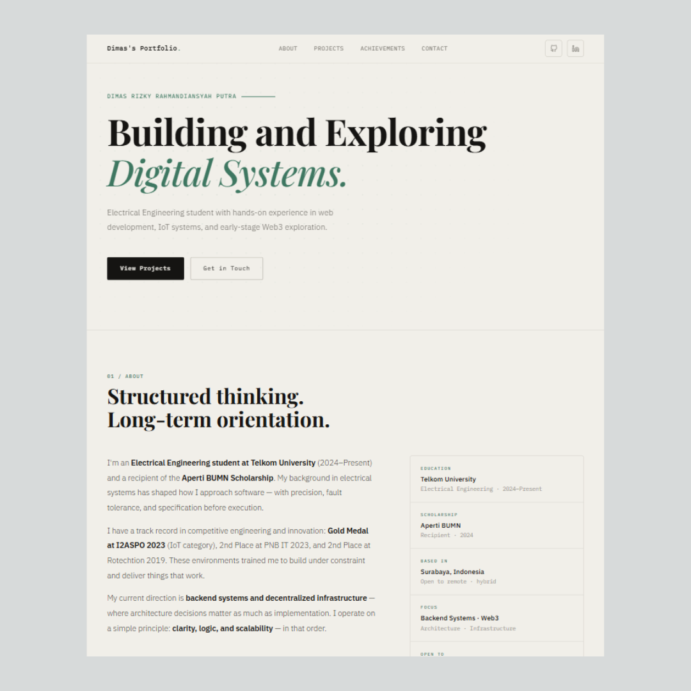

# Personal Engineering Portfolio

A structured personal portfolio website built to present my technical direction, selected projects, and engineering mindset.

## Purpose
To establish a clean and minimal digital identity while showcasing practical web development experience and system-oriented thinking.

## Tech Stack
- HTML
- CSS
- JavaScript

## Features
- Responsive layout
- Minimal UI design
- Structured content sections
- Smooth scroll interactions

## Live Demo
[View Website](https://your-link.com)

## Preview

## Notes
This project focuses on clarity, structured layout, and performance optimization rather than heavy animations or visual effects.
